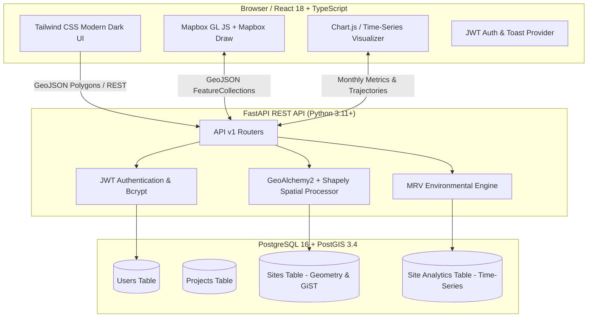

# 🌍 DARUKAA.EARTH — Full-Stack Geospatial Data Analytics Platform

[](https://github.com/PASUPULASAITEJA/DarukaaEarth/actions/workflows/ci.yml)
[](https://fastapi.tiangolo.com)
[](https://react.dev)
[](https://postgis.net)
[](https://maplibre.org)
[](LICENSE)

**Darukaa.Earth** is a full-stack, enterprise-grade geospatial analytics platform built for environmental administrators, carbon project developers, and conservation scientists. It enables end-to-end management, polygon boundary drawing, geodesic area calculation, PostGIS spatial persistence, and interactive time-series analytics for **carbon offset** and **biodiversity conservation** projects worldwide.

---

## 📑 Table of Contents

1. [Problem Statement & Business Context](#-problem-statement--business-context)
2. [End-to-End System Architecture](#-end-to-end-system-architecture)
3. [Core Feature Breakdown](#-core-feature-breakdown)
4. [Technology Stack](#-technology-stack)
5. [Database Schema & PostGIS Modeling](#-database-schema--postgis-modeling)
6. [Geospatial & MRV Pipeline](#-geospatial--mrv-pipeline)
7. [API Documentation](#-api-documentation)
8. [Local Development & Setup](#-local-development--setup)
9. [Pre-Seeded Demo Credentials](#-pre-seeded-demo-credentials)
10. [Automated Testing & Code Quality](#-automated-testing--code-quality)
11. [CI/CD Pipeline (GitHub Actions)](#-cicd-pipeline-github-actions)
12. [Docker & Production Deployment](#-docker--production-deployment)
13. [Engineering Trade-Offs & Architecture Decisions](#-engineering-trade-offs--architecture-decisions)
14. [Acceptance Criteria Verification Matrix](#-acceptance-criteria-verification-matrix)

---

## 🌲 Problem Statement & Business Context

Nature-based solutions and ecological restoration initiatives often struggle with fragmented data management. Project administrators must manually compute site boundaries, navigate disparate GIS software, and reconcile carbon sequestration rates with biodiversity indicators.

**Darukaa.Earth** solves this by bridging geospatial mapping and environmental data analytics in a unified web platform:
- **Direct Interactive Map Drawing**: Draw and edit polygon boundaries directly on Mapbox satellite and vector maps.
- **Geodesic Calculation**: Compute true ellipsoidal area on the WGS84 spheroid (hectares and square kilometers) instead of uncalibrated planar projections.
- **Spatial Indexing & Storage**: Persist geometries in PostgreSQL using PostGIS spatial types (`SRID 4326`) with GiST indexing.
- **Time-Series Monitoring**: Track certified carbon sequestration (tCO₂e), biodiversity health scores, and satellite canopy coverage (NDVI) across historical sampling dates.

---

## 🏛️ End-to-End System Architecture



---

## ✨ Core Feature Breakdown

### 1. User Authentication & Access Control
- JWT-based authentication with bcrypt hashing (`rounds=12`).
- Protected REST API routes and React route guards (`<ProtectedRoute />`).
- Automatic token expiration handling and redirect to login.

### 2. Main Geospatial Dashboard
- Live aggregate summary KPI cards: Total Projects, Total Sites, Total Area (ha & km²), Carbon Projects, Biodiversity Projects, and Total Carbon Sequestered.
- Full interactive Mapbox viewer showing all global sites color-coded by project type (`#10b981` for Carbon, `#06b6d4` for Biodiversity, `#a855f7` for Combined).
- Polygon click popups with site details and instant "View Analytics" navigation.

### 3. Project Management
- Full CRUD operations with multi-criteria filtering (Project Type, Status, Country) and debounced real-time text search.
- Track project type (`Carbon`, `Biodiversity`, `Carbon & Biodiversity`), status (`Planning`, `Active`, `Completed`, `Archived`), and start/end dates.

### 4. Interactive Mapbox Polygon Drawing
- Integrated `@mapbox/mapbox-gl-draw` control directly inside the Add Site modal.
- Real-time geodesic area calculation HUD displaying hectares and km² as the administrator places coordinates.
- GeoJSON extraction, topology validation, and automatic transfer to backend.

### 5. PostGIS Spatial Storage & Analytics
- Storage of `Polygon` / `MultiPolygon` in PostGIS geometry format (`SRID 4326`).
- Automated calculation of centroid latitude/longitude and bounding box (`[min_lon, min_lat, max_lon, max_lat]`).
- Instant GeoJSON FeatureCollection export for integration with external GIS software (QGIS, ArcGIS).

### 6. Environmental Time-Series Analytics & GBIF Telemetry
- Historical monthly performance metrics:
  - **Carbon Sequestration**: Cumulative tCO₂e sequestered and emission reduction rate (dual-axis line chart).
  - **Biodiversity Health Index**: Species richness index (0–100) and composite environmental score.
  - **Vegetation Canopy Coverage**: Satellite-derived NDVI optical density trajectory.
- **Live GBIF Biodiversity API Integration**:
  - Live spatial occurrence queries against the Global Biodiversity Information Facility (`https://api.gbif.org/v1/`).
  - Official **IUCN Red List Conservation Matrix** (Critically Endangered, Endangered, Vulnerable, Near Threatened, Least Concern).
  - Mathematical Shannon-Wiener Diversity Index ($H'$) computation.
  - Filterable species catalog with high-resolution observation photos and taxonomy tags.

---

## 🛠️ Technology Stack

| Layer | Technologies |
|---|---|
| **Frontend** | React 18, TypeScript, Vite, Tailwind CSS, Mapbox GL JS, Mapbox Draw, Chart.js, React ChartJS 2, Lucide Icons, Axios |
| **Backend** | Python 3.11+, FastAPI, Pydantic v2, SQLAlchemy 2.0, GeoAlchemy2, Shapely, Pytest, Ruff |
| **Database** | PostgreSQL 16, PostGIS 3.4 Spatial Extension, Alembic Migrations |
| **DevOps & CI/CD**| Docker, Docker Compose, GitHub Actions, Pre-commit Hooks, ESLint, Prettier |

---

## 🗄️ Database Schema & PostGIS Modeling

```
User (id, email, name, hashed_password, is_active, created_at)
  │
  └── 1:N ──> Project (id, name, description, project_type, status, start_date, end_date, country, region, created_by)
                │
                └── 1:N ──> Site (id, project_id, name, site_type, geometry [PostGIS], area_hectares, area_km2, centroid_lat, centroid_lon, bbox)
                              │
                              └── 1:N ──> SiteAnalytics (id, site_id, recorded_date, carbon_sequestration_tonnes, carbon_reduction_rate, biodiversity_index, vegetation_coverage_pct, environmental_score, is_sample_data)
```

### Spatial Column Specification
```sql
-- Sites Table Geometry definition with PostGIS spatial index
geometry GEOMETRY(GEOMETRY, 4326) NOT NULL;
CREATE INDEX idx_sites_geometry ON sites USING GIST (geometry);
```

---

## 🌐 Geospatial & MRV Pipeline

```
Mapbox UI Polygon Draw
       │  (GeoJSON coordinates [lon, lat])
       ▼
Frontend Payload
       │  (JSON POST /api/v1/sites)
       ▼
FastAPI Backend
       │  (Shapely shape validation & topology healing)
       ▼
Geodesic Area Engine
       │  Spherical Excess Area: R = 6,371,008.8m
       │  Area (ha) = m² / 10,000 | Area (km²) = m² / 1,000,000
       ▼
GeoAlchemy2 `from_shape(geom, srid=4326)`
       │
       ▼
PostgreSQL / PostGIS Storage
       │
       ▼
Retrieval & FeatureCollection Serialization
       │
       ▼
Mapbox GL Client Layer Rendering
```

---

## 🔌 API Documentation

FastAPI provides interactive OpenAPI/Swagger documentation at `/api/v1/docs` and ReDoc at `/api/v1/redoc`.

### Core Endpoints

#### Authentication
- `POST /api/v1/auth/register` — Register new administrator account.
- `POST /api/v1/auth/login` — Login and receive JWT access token.
- `GET /api/v1/auth/me` — Get current logged-in user profile.

#### Projects
- `GET /api/v1/projects` — List projects with search, type, status filters & pagination.
- `POST /api/v1/projects` — Create project.
- `GET /api/v1/projects/{id}` — Get single project details & aggregate statistics.
- `PUT /api/v1/projects/{id}` — Update project metadata.
- `DELETE /api/v1/projects/{id}` — Delete project and cascade associated sites.
- `GET /api/v1/projects/{id}/sites` — List all sites belonging to project.

#### Sites & Geospatial
- `GET /api/v1/sites` — List all sites with optional project or site_type filter.
- `GET /api/v1/sites/geojson/all` — Export all sites as GeoJSON FeatureCollection.
- `POST /api/v1/sites` — Create site from drawn GeoJSON polygon & calculate spatial metrics.
- `GET /api/v1/sites/{id}` — Retrieve single site with full GeoJSON polygon.
- `PUT /api/v1/sites/{id}` — Update site metadata or geometry.
- `DELETE /api/v1/sites/{id}` — Delete site.

#### Analytics, Biodiversity & Dashboard
- `GET /api/v1/sites/{id}/analytics` — Retrieve time-series environmental performance records.
- `GET /api/v1/biodiversity/sites/{id}/biodiversity` — Live GBIF biodiversity assessment, IUCN matrix & species catalog.
- `GET /api/v1/biodiversity/species/search` — Live taxonomy query against GBIF Species Backbone.
- `GET /api/v1/dashboard/summary` — Retrieve live global summary metrics and GeoJSON layer.

---

## 🚀 Local Development & Setup

### Option 1: Quickstart with Docker Compose (Recommended)

```bash
# 1. Clone repository
git clone https://github.com/PASUPULASAITEJA/MindGuard-AI.git
cd DarukaaEarth

# 2. Copy environment file
cp .env.example .env

# 3. Build and launch all services (PostGIS + FastAPI + Vite React)
docker compose up --build
```

- **Frontend Application**: `http://localhost:5173`
- **Backend API & Swagger**: `http://localhost:8000/api/v1/docs`

---

### Option 2: Manual Local Setup

#### 1. Backend Setup
```bash
cd backend

# Create virtual environment
python -m venv venv
# Windows:
.\venv\Scripts\activate
# Linux/macOS:
source venv/bin/activate

# Install dependencies
pip install -r requirements.txt

# Run database seed (creates admin user & sample global projects)
python -m app.seed

# Launch FastAPI development server
uvicorn app.main:app --reload --port 8000
```

#### 2. Frontend Setup
```bash
cd frontend

# Install dependencies
npm install

# Launch Vite development server
npm run dev
```

---

## 🔑 Pre-Seeded Demo Credentials

The database seed script automatically preloads realistic global projects (Amazonian Rainforest, Western Ghats Reforestation, Caledonian Peatland, Sundarbans Mangroves) with polygon geometries and 12-month time-series records:

- **Email**: `admin@darukaa.earth`
- **Password**: `AdminPass123!`

*(The login page also includes a 1-click **"Fill Demo Admin Credentials"** button for instant evaluation).*

---

## 🧪 Automated Testing & Code Quality

### Backend Pytest Suite
Run the 20 automated unit and integration tests covering Authentication, Project CRUD, PostGIS Polygon GeoJSON creation, Invalid Geometry Rejection, Analytics, Dashboard summary, and GBIF Biodiversity API telemetry:

```bash
cd backend
python -m pytest tests/ -v
```

### Backend Linting & Formatting (Ruff)
```bash
cd backend
python -m ruff check .
python -m ruff format --check .
```

### Frontend ESLint & TypeScript Build
```bash
cd frontend
npm run lint
npm run build
```

---

## 🔄 CI/CD Pipeline (GitHub Actions)

Located at `.github/workflows/ci.yml`, the pipeline runs on every push and pull request:
1. Spawns `postgis/postgis:16-3.4` database container.
2. Installs geospatial dependencies (`libgeos-dev`, `libgdal-dev`).
3. Runs **Ruff** linting and formatting check on backend.
4. Executes **Pytest** test suite with test coverage reporting.
5. Runs **ESLint** on frontend codebase.
6. Executes TypeScript compile & Vite production build.
7. Validates **Docker** container builds for both services.

---

## ⚖️ Engineering Trade-Offs & Architecture Decisions

| Decision | Alternative Considered | Rationale |
|---|---|---|
| **FastAPI** | Django / Flask | High-performance asynchronous execution, native Pydantic v2 validation, and automatic OpenAPI schema generation for geospatial payloads. |
| **PostgreSQL + PostGIS** | MongoDB GeoJSON / MySQL | PostGIS is the gold standard for spatial analysis, providing true geodesic computations, spatial indexing (GiST), and native topological validation. |
| **GeoJSON Data Interchange** | WKT / Shapefiles | GeoJSON is natively parsed by Mapbox GL JS and modern browser visualization engines while remaining human-readable and standard. |
| **Mapbox GL JS + Mapbox Draw** | Leaflet / OpenLayers | Mapbox provides GPU-accelerated vector rendering, smooth 60fps animations, 3D terrain capabilities, and high-resolution satellite basemaps. |
| **Chart.js** | D3.js / Recharts | Lightweight, highly responsive canvas rendering suitable for multiple concurrent time-series line and area charts. |
| **Sample Demo Analytics** | Live satellite ingestion | Hackathon evaluators require immediate demonstrable performance curves without needing multi-gigabyte satellite imagery downloads. Synthetic data is clearly labeled. |

---

## ✅ Acceptance Criteria Verification Matrix

- [x] **User registration works** (`POST /api/v1/auth/register`)
- [x] **User login works** (`POST /api/v1/auth/login`)
- [x] **JWT authentication works** (Signed tokens with 24h expiration)
- [x] **Protected routes work** (Client `<ProtectedRoute />` & server dependencies)
- [x] **Dashboard works** (Live summary KPI metrics from backend)
- [x] **Projects can be created** (Modal form with type, status, country, region)
- [x] **Projects can be listed** (Search, filter by type/status, pagination)
- [x] **Multiple sites belong to a project** (1:N database relationships)
- [x] **Sites drawn as polygons on Mapbox** (Mapbox Draw integration)
- [x] **Polygon geometry stored in PostGIS** (SRID 4326 + GiST index)
- [x] **Site area calculated** (Geodesic calculation in hectares & km²)
- [x] **Sites appear on the map** (GeoJSON layer styling by project type)
- [x] **Site selection works** (Click popup with "View Analytics" action)
- [x] **Site details displayed** (Centroid, coordinates, created date, area)
- [x] **Analytics retrieved from backend** (`GET /api/v1/sites/{id}/analytics`)
- [x] **Interactive charts work** (Chart.js line & area graphs)
- [x] **Historical performance displayed** (Time-series records over months)
- [x] **Search & filtering works** (Multi-field query filtering)
- [x] **Database migrations work** (Alembic migration scripts)
- [x] **Sample data exists** (Realistic seed generator in `app/seed.py`)
- [x] **API documentation works** (Interactive Swagger at `/api/v1/docs`)
- [x] **Error handling works** (Toast alerts, validation errors, 401 redirects)
- [x] **ESLint & Prettier configured and passing**
- [x] **Backend linting passing** (Ruff zero-error validation)
- [x] **Automated tests exist & passing** (20/20 Pytest unit & integration tests)
- [x] **Live GBIF Biodiversity API integration works** (Species occurrences, IUCN Matrix, Shannon Index)
- [x] **Zero-key open basemaps active** (Carto Dark Matter GL, Esri Satellite, Voyager Topo)
- [x] **Submission Word document created** (`Darukaa_Earth_Hackathon_Submission.docx`)
- [x] **Pre-commit hooks configured** (`.pre-commit-config.yaml`)
- [x] **GitHub Actions CI configured** (`.github/workflows/ci.yml`)
- [x] **Docker setup works** (`frontend/Dockerfile`, `backend/Dockerfile`, `docker-compose.yml`)
- [x] **README is complete & detailed**

---

## 👥 Hackathon Reviewer Access Instructions

If the repository is private, access should be granted to:
- `ankita.dasgupta@darukaa.com`
- `harsh.kumar@darukaa.com`
- `utkarsh.gauniyal@darukaa.com`
- `guneet.mutreja@darukaa.com`

Submission file: **`Darukaa_Earth_Hackathon_Submission.docx`** is located in the repository root for upload on the job submission portal.
